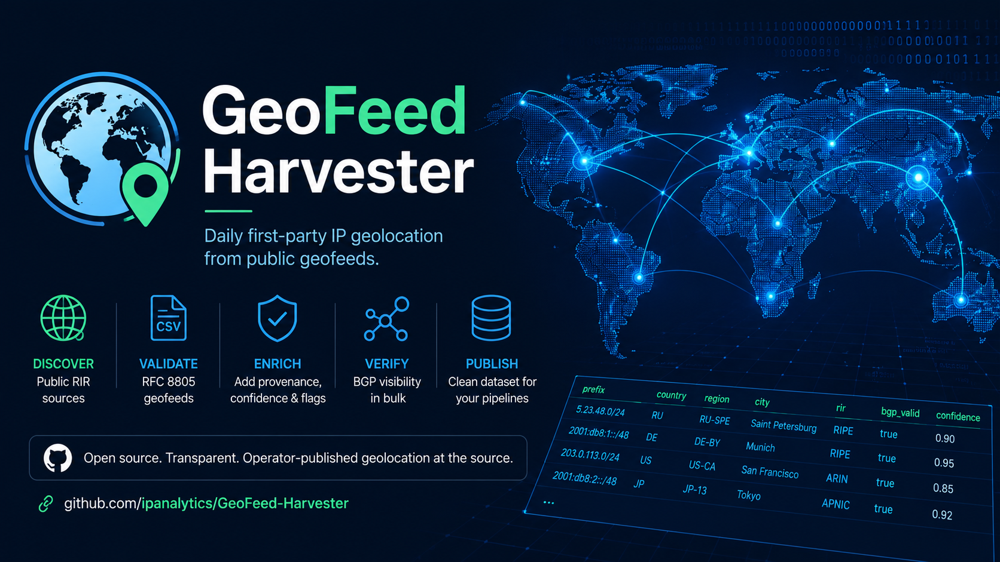
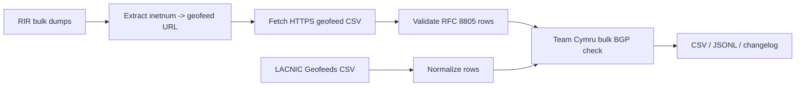

# GeoFeed Harvester

Daily first-party IP geolocation from public geofeeds.

<p align="center">
  
</p>

GeoFeed Harvester discovers RFC 8805 geofeed files from public RIR data,
downloads them, validates every row, adds provenance, checks BGP visibility in
bulk, and publishes a clean dataset that can be consumed by GeoForge, MMDB
builders, fraud systems, routing tools, and research pipelines.

The goal is simple: use operator-published geolocation at the source instead of
repackaging opaque commercial GeoIP databases.

<!-- GEOFEED_STATS_START -->
## Latest Run

- Generated at: `2026-08-04T06:11:37+00:00`
- Valid rows: `375,407`
- Raw rows: `437,673`
- Unique prefixes: `375,407`
- Unique geofeed URLs: `3,665`
- Countries: `286`
- Failed geofeed fetches: `969`
- Added / removed / changed prefixes: `1,817` / `146,247` / `1,329`
- CSV gzip size: `2.9 MB`
- JSONL gzip size: `3.6 MB`
- Parquet size: `2.1 MB`

<!-- GEOFEED_STATS_END -->

## What It Produces

Every run writes:

```text
dist/geofeed.csv
dist/geofeed.jsonl
dist/changelog.md
```

The GitHub workflow uploads compressed artifacts because the full JSONL dataset
is larger than GitHub's normal per-file git limit:

```text
geofeed.csv.gz
geofeed.jsonl.gz
geofeed.parquet
failed-geofeeds.csv
diff.json
manifest.json
changelog.md
SHA256SUMS
```

`geofeed.csv` is the normalized dataset:

```csv
prefix,country,region,city,postal_code,rir,inetnum,url,fetched_at,signed,signature_valid,bgp_valid,confidence,flags
5.23.48.0/24,RU,RU-SPE,Saint Petersburg,,RIPE,0.0.0.0/0,https://example/geofeed.csv,2026-05-23T09:13:26+00:00,false,false,true,0.90,
```

`geofeed.jsonl` contains the same records as JSON objects, one row per line.

`changelog.md` summarizes row counts, flagged rows, and per-RIR coverage for the
latest run.

## Downloading The Daily Dataset

If this repository publishes artifacts through GitHub Actions, download the
latest run from:

```text
https://github.com/ipanalytics/GeoFeed-Harvester/actions/workflows/harvest.yml
```

The daily workflow publishes a date-stamped GitHub Release and marks it as the
latest release. Download the latest release assets through stable URLs:

```bash
curl -L -o geofeed.csv.gz \
  https://github.com/ipanalytics/GeoFeed-Harvester/releases/latest/download/geofeed.csv.gz

curl -L -o geofeed.jsonl.gz \
  https://github.com/ipanalytics/GeoFeed-Harvester/releases/latest/download/geofeed.jsonl.gz

curl -L -o geofeed.parquet \
  https://github.com/ipanalytics/GeoFeed-Harvester/releases/latest/download/geofeed.parquet

curl -L -o manifest.json \
  https://github.com/ipanalytics/GeoFeed-Harvester/releases/latest/download/manifest.json
```

For automation, prefer release assets when available because the URL is stable.
Actions artifacts are useful for inspection, but GitHub expires them according
to repository retention settings.

The repository also keeps small metadata files in git:

```text
runs/latest-changelog.md
runs/latest-manifest.json
runs/latest-SHA256SUMS
```

## Source Coverage

Automatic discovery currently uses unauthenticated public sources:

| Source | Method | Status |
| --- | --- | --- |
| RIPE | public bulk `inetnum` / `inet6num` dumps | enabled |
| APNIC | public bulk `inetnum` / `inet6num` dumps | enabled |
| AFRINIC | public bulk database dump | enabled |
| LACNIC | public Geofeeds Service CSV | enabled |
| ARIN | authenticated bulk WHOIS or RDAP fallback | not enabled by default |

ARIN bulk WHOIS requires authorization, so it is intentionally not queried as
part of the unauthenticated daily job. ARIN-style records are supported when
provided manually or by a future authenticated adapter: `NetRange` is treated as
`inetnum`, and `Comment` is treated as `remarks`.

## Pipeline

The default production run is bulk-first:



Validation rules include:

- HTTPS-only geofeed URLs.
- RFC 8805 CSV parsing.
- Country code shape validation.
- Region code shape validation.
- Drop rows outside the referring `inetnum`.
- Prefer the most specific referring `inetnum` on overlap.
- Add provenance: RIR, source URL, referring inetnum, fetch time.
- Add confidence and conflict flags.
- Validate ISO-3166 country and ISO-3166-2 subdivision codes when the optional
  `pycountry` catalog is available.
- Optional Team Cymru bulk BGP visibility checks.

## Running Locally

Install:

```bash
python -m venv .venv
. .venv/bin/activate
pip install -e ".[dev]"
```

Run the full automatic sequence:

```bash
geofeed-harvester \
  --auto-discover \
  --out-dir dist \
  --cache-dir .cache/geofeeds \
  --bulk-dir .cache/rir-bulk \
  --direct-geofeed-dir .cache/direct-geofeeds \
  --normalized-rir-dump data/rir.txt \
  --concurrency 32 \
  --bgp-validator cymru
```

The first run downloads large bulk files. Daily runs reuse cache metadata and
HTTP validators where available.

Optional production enrichments:

```bash
geofeed-harvester \
  --auto-discover \
  --arin-rdap-seed data/arin-rdap-seeds.txt \
  --arin-rdap-max-queries 100 \
  --signature-verdicts data/signature-verdicts.json
```

`--arin-rdap-seed` is intentionally seed-based. It does not scan ARIN address
space; it only enriches explicit IPs or prefixes listed by the operator.

`--signature-verdicts` accepts JSON produced by an external CMS/RPKI verifier,
for example:

```json
{
  "https://example.net/geofeed.csv": {
    "signature_valid": true
  }
}
```

## Manual Input Mode

You can also provide your own RIR-like records:

```text
inetnum: 203.0.113.0/24
geofeed: https://example.net/geofeed.csv
source: RIPE

NetRange: 198.51.100.0 - 198.51.100.255
Comment: Geofeed https://example.org/geofeed.csv
source: ARIN
```

Then run:

```bash
geofeed-harvester \
  --rir-dump data/rir.txt \
  --out-dir dist \
  --cache-dir .cache/geofeeds \
  --concurrency 32 \
  --bgp-validator cymru
```

## GitHub Actions

This repository includes a daily workflow:

```text
.github/workflows/harvest.yml
```

It runs:

```bash
geofeed-harvester --auto-discover ...
```

and commits:

```text
runs/latest-changelog.md
runs/latest-SHA256SUMS
```

Large datasets are uploaded as compressed workflow artifacts instead of being
committed to git.

The workflow publishes stable daily downloads by attaching:

```text
dist/geofeed.csv.gz
dist/geofeed.jsonl.gz
dist/geofeed.parquet
dist/failed-geofeeds.csv
dist/diff.json
dist/manifest.json
dist/changelog.md
dist/SHA256SUMS
```

to a date-stamped release such as `dataset-2026-05-23` and marks that release
as GitHub's latest release. Stable `/releases/latest/download/...` URLs continue
to work.

The default workflow does not enable Team Cymru checks because GitHub-hosted
runners can hit TCP/43 rate limits or empty responses. Run `--bgp-validator
cymru` manually or from infrastructure with stable egress when BGP confidence
signals are required.

## Consuming The Dataset

CSV:

```bash
curl -L -o geofeed.csv.gz \
  https://github.com/ipanalytics/GeoFeed-Harvester/releases/latest/download/geofeed.csv.gz
```

JSONL:

```bash
curl -L -o geofeed.jsonl.gz \
  https://github.com/ipanalytics/GeoFeed-Harvester/releases/latest/download/geofeed.jsonl.gz
```

Parquet:

```bash
curl -L -o geofeed.parquet \
  https://github.com/ipanalytics/GeoFeed-Harvester/releases/latest/download/geofeed.parquet
```

Metadata and daily diff:

```bash
curl -L -o manifest.json \
  https://github.com/ipanalytics/GeoFeed-Harvester/releases/latest/download/manifest.json

curl -L -o diff.json \
  https://github.com/ipanalytics/GeoFeed-Harvester/releases/latest/download/diff.json
```

Example Python:

```python
import csv

with open("geofeed.csv", newline="", encoding="utf-8") as fh:
    for row in csv.DictReader(fh):
        if row["bgp_valid"] == "true":
            print(row["prefix"], row["country"], row["city"])
```

## Standards

- Geofeed file format: RFC 8805.
- Discovery mechanism: RFC 9632, which replaced RFC 9092.
- Large-scale discovery should use RIR bulk data instead of brute-force WHOIS or
  RDAP scans.
- RPKI CMS signature verification is delegated to external tooling when enabled.

## Why Team Cymru

The harvester can use Team Cymru's IP-to-ASN Mapping Service for bulk BGP
visibility checks. It sends many probe IPs in one TCP/43 bulk WHOIS session
instead of making thousands of individual WHOIS calls.

This is used only for route visibility/confidence. Team Cymru is not treated as
a geolocation source.

## Trust Model

This dataset is not a magic truth oracle. It is a normalized view of
operator-published geofeed data with explicit provenance.

Useful confidence signals:

- The row came from a public RIR-discovered geofeed.
- The prefix is inside the referring inetnum.
- The prefix is visible in BGP.
- The row has no schema or overlap flags.
- Future signature validation can confirm signed geofeeds.

Rows with flags are retained because they are useful for debugging and research,
but consumers can filter them out.

## Development

Run tests:

```bash
python -m pytest
```

Compile check:

```bash
python -m compileall geofeed_harvester tests
```

## Status

This is an early harvester implementation. The core pipeline works, but the next
valuable additions are:

- authenticated ARIN bulk adapter;
- first-class CMS signature discovery for signed geofeeds;
- optional release retention policy for historical daily datasets.
