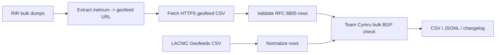

_English version: [README.md](README.md)_

# GeoFeed Harvester

Ежедневная геолокация IP-адресов от первоисточника (first-party) на основе публичных geofeeds.

<p align="center">
  
</p>

GeoFeed Harvester обнаруживает файлы geofeed по RFC 8805 в публичных данных RIR, скачивает их, проверяет каждую строку, добавляет сведения о происхождении (provenance), массово проверяет видимость в BGP и публикует чистый набор данных, который могут использовать GeoForge, сборщики MMDB, антифрод-системы (fraud systems), инструменты маршрутизации и исследовательские пайплайны.

Цель проста: использовать геолокацию, опубликованную операторами, из первоисточника, а не переупаковывать непрозрачные коммерческие базы GeoIP.

<!-- GEOFEED_STATS_START -->
## Последний запуск

- Время генерации: `2026-09-12T13:17:29+00:00`
- Валидных строк: `533,800`
- Исходных строк: `597,909`
- Уникальных префиксов: `533,800`
- Уникальных URL geofeed: `4,179`
- Стран: `286`
- Неудачных загрузок geofeed: `713`
- Добавлено / удалено / изменено префиксов: `865` / `654` / `6,079`
- Размер CSV в gzip: `4.4 MB`
- Размер JSONL в gzip: `5.6 MB`
- Размер Parquet: `3.1 MB`

<!-- GEOFEED_STATS_END -->

## Что он создаёт

При каждом запуске записываются:

```text
dist/geofeed.csv
dist/geofeed.jsonl
dist/changelog.md
```

GitHub workflow загружает сжатые артефакты, потому что полный набор данных JSONL превышает обычный лимит GitHub на размер одного файла в git:

```text
geofeed.csv.gz
geofeed.jsonl.gz
geofeed.parquet
failed-geofeeds.csv
diff.json
manifest.json
changelog.md
SHA256SUMS
```

`geofeed.csv` — нормализованный набор данных:

```csv
prefix,country,region,city,postal_code,rir,inetnum,url,fetched_at,signed,signature_valid,bgp_valid,confidence,flags
5.23.48.0/24,RU,RU-SPE,Saint Petersburg,,RIPE,0.0.0.0/0,https://example/geofeed.csv,2026-05-23T09:13:26+00:00,false,false,true,0.90,
```

`geofeed.jsonl` содержит те же записи в виде JSON-объектов, по одной строке на запись.

`changelog.md` содержит сводку по количеству строк, помеченным строкам и покрытию по каждому RIR для последнего запуска.

## Загрузка ежедневного набора данных

Если этот репозиторий публикует артефакты через GitHub Actions, скачивайте последний запуск отсюда:

```text
https://github.com/ipanalytics/GeoFeed-Harvester/actions/workflows/harvest.yml
```

Ежедневный workflow публикует GitHub Release с датой в имени и помечает его как последний релиз (latest release). Ассеты последнего релиза скачиваются по стабильным URL:

```bash
curl -L -o geofeed.csv.gz \
  https://github.com/ipanalytics/GeoFeed-Harvester/releases/latest/download/geofeed.csv.gz

curl -L -o geofeed.jsonl.gz \
  https://github.com/ipanalytics/GeoFeed-Harvester/releases/latest/download/geofeed.jsonl.gz

curl -L -o geofeed.parquet \
  https://github.com/ipanalytics/GeoFeed-Harvester/releases/latest/download/geofeed.parquet

curl -L -o manifest.json \
  https://github.com/ipanalytics/GeoFeed-Harvester/releases/latest/download/manifest.json
```

Для автоматизации предпочтительны ассеты релизов, когда они доступны, так как URL стабилен. Артефакты Actions полезны для проверки, но GitHub удаляет их по истечении срока согласно настройкам хранения (retention) репозитория.

Репозиторий также хранит небольшие файлы метаданных в git:

```text
runs/latest-changelog.md
runs/latest-manifest.json
runs/latest-SHA256SUMS
```

## Покрытие источников

Автоматическое обнаружение в настоящее время использует публичные источники без аутентификации:

| Источник | Метод | Статус |
| --- | --- | --- |
| RIPE | публичные массовые выгрузки `inetnum` / `inet6num` | включён |
| APNIC | публичные массовые выгрузки `inetnum` / `inet6num` | включён |
| AFRINIC | публичная массовая выгрузка базы данных | включён |
| LACNIC | публичный CSV сервиса Geofeeds Service | включён |
| ARIN | аутентифицированный массовый WHOIS или резервный RDAP | не включён по умолчанию |

Массовый WHOIS для ARIN требует авторизации, поэтому он намеренно не опрашивается в рамках ежедневного задания без аутентификации. Записи в стиле ARIN поддерживаются при ручной подаче или через будущий аутентифицированный адаптер: `NetRange` обрабатывается как `inetnum`, а `Comment` — как `remarks`.

## Конвейер

Производственный запуск по умолчанию сначала использует массовые источники (bulk-first):



Правила валидации включают:

- URL geofeed только по HTTPS.
- Разбор CSV по RFC 8805.
- Проверку формата кода страны.
- Проверку формата кода региона.
- Отбрасывание строк вне диапазона ссылающегося `inetnum`.
- При пересечении предпочтение наиболее конкретному ссылающемуся `inetnum`.
- Добавление сведений о происхождении: RIR, исходный URL, ссылающийся inetnum, время загрузки.
- Добавление показателя уверенности (confidence) и флагов конфликтов.
- Проверку кодов стран ISO-3166 и кодов административных единиц ISO-3166-2, если доступен необязательный каталог `pycountry`.
- Необязательные массовые проверки видимости в BGP через Team Cymru.

## Локальный запуск

Установка:

```bash
python -m venv .venv
. .venv/bin/activate
pip install -e ".[dev]"
```

Запуск полной автоматической последовательности:

```bash
geofeed-harvester \
  --auto-discover \
  --out-dir dist \
  --cache-dir .cache/geofeeds \
  --bulk-dir .cache/rir-bulk \
  --direct-geofeed-dir .cache/direct-geofeeds \
  --normalized-rir-dump data/rir.txt \
  --concurrency 32 \
  --bgp-validator cymru
```

При первом запуске загружаются большие bulk-файлы. Ежедневные запуски повторно
используют метаданные кэша и HTTP-валидаторы там, где они доступны.

Необязательные обогащения для production:

```bash
geofeed-harvester \
  --auto-discover \
  --arin-rdap-seed data/arin-rdap-seeds.txt \
  --arin-rdap-max-queries 100 \
  --signature-verdicts data/signature-verdicts.json
```

`--arin-rdap-seed` намеренно работает по принципу seed-списка. Он не сканирует
адресное пространство ARIN; он лишь обогащает явно перечисленные оператором
IP-адреса или префиксы.

`--signature-verdicts` принимает JSON, созданный внешним верификатором
CMS/RPKI, например:

```json
{
  "https://example.net/geofeed.csv": {
    "signature_valid": true
  }
}
```

## Режим ручного ввода

Вы также можете предоставить собственные записи, аналогичные записям RIR:

```text
inetnum: 203.0.113.0/24
geofeed: https://example.net/geofeed.csv
source: RIPE

NetRange: 198.51.100.0 - 198.51.100.255
Comment: Geofeed https://example.org/geofeed.csv
source: ARIN
```

Затем выполните:

```bash
geofeed-harvester \
  --rir-dump data/rir.txt \
  --out-dir dist \
  --cache-dir .cache/geofeeds \
  --concurrency 32 \
  --bgp-validator cymru
```

## GitHub Actions

В этом репозитории есть ежедневный workflow:

```text
.github/workflows/harvest.yml
```

Он запускает:

```bash
geofeed-harvester --auto-discover ...
```

и коммитит:

```text
runs/latest-changelog.md
runs/latest-SHA256SUMS
```

Большие наборы данных загружаются как сжатые артефакты workflow вместо коммита
в git.

Workflow публикует стабильные ежедневные загрузки, прикрепляя:

```text
dist/geofeed.csv.gz
dist/geofeed.jsonl.gz
dist/geofeed.parquet
dist/failed-geofeeds.csv
dist/diff.json
dist/manifest.json
dist/changelog.md
dist/SHA256SUMS
```

к релизу с датой в имени, например `dataset-2026-05-23`, и помечает этот релиз
как последний (latest) релиз GitHub. Стабильные URL вида
`/releases/latest/download/...` продолжают работать.

В workflow по умолчанию проверки Team Cymru не включены, поскольку на
GitHub-hosted раннерах можно упереться в rate limit по TCP/43 или получать
пустые ответы. Запускайте `--bgp-validator cymru` вручную или с инфраструктуры
со стабильным исходящим трафиком, когда требуются сигналы достоверности BGP.

## Использование набора данных

CSV:

```bash
curl -L -o geofeed.csv.gz \
  https://github.com/ipanalytics/GeoFeed-Harvester/releases/latest/download/geofeed.csv.gz
```

JSONL:

```bash
curl -L -o geofeed.jsonl.gz \
  https://github.com/ipanalytics/GeoFeed-Harvester/releases/latest/download/geofeed.jsonl.gz
```

Parquet:

```bash
curl -L -o geofeed.parquet \
  https://github.com/ipanalytics/GeoFeed-Harvester/releases/latest/download/geofeed.parquet
```

Метаданные и ежедневный diff:

```bash
curl -L -o manifest.json \
  https://github.com/ipanalytics/GeoFeed-Harvester/releases/latest/download/manifest.json

curl -L -o diff.json \
  https://github.com/ipanalytics/GeoFeed-Harvester/releases/latest/download/diff.json
```

Пример на Python:

```python
import csv

with open("geofeed.csv", newline="", encoding="utf-8") as fh:
    for row in csv.DictReader(fh):
        if row["bgp_valid"] == "true":
            print(row["prefix"], row["country"], row["city"])
```

## Стандарты

- Формат файла Geofeed: RFC 8805.
- Механизм обнаружения: RFC 9632, заменивший RFC 9092.
- Для массового обнаружения следует использовать bulk-данные RIR вместо
  brute-force-перебора через WHOIS или RDAP-сканирований.
- Проверка подписей RPKI CMS при включении делегируется внешним инструментам.

## Почему Team Cymru

Харвестер может использовать сервис Team Cymru IP-to-ASN Mapping Service для
массовых проверок видимости в BGP. Он отправляет множество пробных IP-адресов
в одной bulk-сессии WHOIS по TCP/43 вместо тысяч отдельных WHOIS-запросов.

Это используется только для оценки видимости/достоверности маршрутов.
Team Cymru не рассматривается как источник геолокации.

## Модель доверия

Этот набор данных — не волшебный оракул истины. Это нормализованное
представление geofeed-данных, опубликованных операторами, с явным указанием
происхождения.

Полезные сигналы достоверности:

- Строка получена из публичного geofeed, обнаруженного через RIR.
- Префикс находится внутри ссылающегося на него inetnum.
- Префикс виден в BGP.
- У строки нет флагов схемы или пересечений.
- Будущая проверка подписей сможет подтвердить подписанные geofeed-файлы.

Строки с флагами сохраняются, поскольку они полезны для отладки и исследований,
но потребители могут их отфильтровать.

## Разработка

Запуск тестов:

```bash
python -m pytest
```

Проверка компиляции:

```bash
python -m compileall geofeed_harvester tests
```

## Статус

Это ранняя реализация харвестера. Основной конвейер работает, но следующими
ценными дополнениями будут:

- адаптер аутентифицированного bulk-доступа к ARIN;
- полноценное обнаружение CMS-подписей для подписанных geofeed-файлов;
- необязательная политика хранения релизов для исторических ежедневных наборов
  данных.
